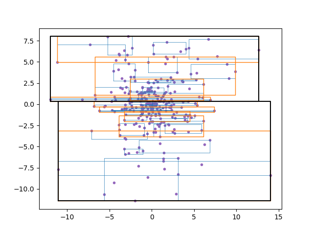

# RTree
**Currently Working in Progress.**

C++ template RTree header only library.

## References
 Guttman, A. (1984). "R-Trees: A Dynamic Index Structure for Spatial Searching" (PDF). Proceedings of the 1984 ACM SIGMOD international conference on Management of data – SIGMOD '84. p. 47.

## Visualization Examples
### 1-dimensional R-Tree structure visualization
`example/visualize_1d`

The x-axis illustrates different levels within the R-tree, and the y-axis displays the size of bounding boxes (in one dimension) for each node.

On the far right, there are green dots representing input points (N = 300). These points are generated from a normal distribution with a mean ($\mu$) of 0 and a standard deviation ($\sigma$) of 5.

### 2-dimensional R-Tree structure visualization
`example/visualize_2d`

The bounding boxes on the graph indicate the coverage range of each node. Additionally, the thickness and color of these bounding boxes are about their respective levels. 'blue', 'orange', and 'black' are used to represent levels 2, 1, and 0, respectively.

Purple dots represent input points (N = 300), generated from a normal distribution with an origin of (0,0), a mean ($\mu$) of 0, and a standard deviation ($\sigma$) of 5.