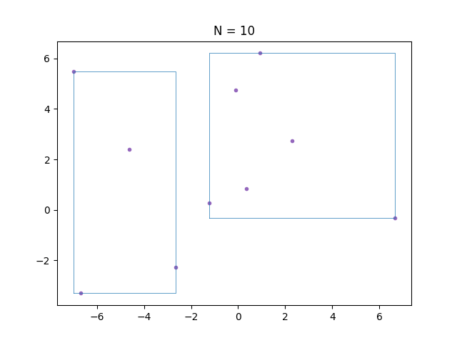

# R-Star-Tree
Header-Only N-dimensional [R-Tree](https://en.wikipedia.org/wiki/R-tree), [R*-Tree](https://en.wikipedia.org/wiki/R*-tree) implementation on Modern C++

And some features to read-only query in GPU ( CUDA, OpenCL, etc. )




The bounding boxes on the graph indicate the coverage range of each node. Additionally, the thickness and color of these bounding boxes are about their respective levels. 'blue', 'orange', and 'black' are used to represent levels 2, 1, and 0, respectively.

Purple dots represent input points (N = 1000), generated from a normal distribution with an origin of (0,0), a mean ($\mu$) of 0, and a standard deviation ($\sigma$) of 5.

Both the Splitting scheme and reinsertion algorithm applied.

## Features
 - Header-Only
 - N-dimensional [R-Tree](https://en.wikipedia.org/wiki/R*-tree), [R*-Tree](https://en.wikipedia.org/wiki/R*-tree) implementation
 - Customizable types ( bounding box, key, data ) with `geometry_traits`
 - convert to contiguous memory layout Read-only query in GPU ( CUDA, OpenCL, etc. )
 - Quadratic Split, [R*-Tree Axis Split](https://en.wikipedia.org/wiki/R*-tree) (default)
 - Reinsert scheme

## References
 Guttman, A. (1984). "R-Trees: A Dynamic Index Structure for Spatial Searching". Proceedings of the 1984 ACM SIGMOD international conference on Management of data – SIGMOD '84. p. 47.

 Norbert Beckmann, Hans-Peter begel, Ralf Schneider, Bernhard Seeger (1990). "The R*-tree: An Efficient and Robust Access Method for Points and Rectangles". Proceedings of the 1990 ACM SIGMOD international conference on Management of data - SIGMOD '90. p. 322-331.

## Dependencies
 **No dependencies required** for core library.

 Unit Tests are using [Google Test](https://github.com/google/googletest), examples are using [Eigen](https://eigen.tuxfamily.org/).

## Sample Codes
```cpp
int main()
{
  // ***************************
  // one-dimension RTree example
  // ***************************

  rtree_type rtree;

  // insert 50 arithmetic sequence of points
  for (int i = 0; i < 50; ++i)
  {
    double point = i;
    int value = i;
    rtree.insert(value_type(point, value));
  }

  // rtree.begin(), rtree.end()
  // iterates over all values in the tree
  for (value_type value : rtree)
  {
    std::cout << "Value Inserted: [" << value.first << ", " << value.second << "]\n";
  }

  auto geometry_filter = [](aabb_type const& bound) -> int
  {
    // if bound does not touch [10,20] skip
    if (bound.min_ > 20 || bound.max_ < 10)
      return 0;
    return 1;
  };
  auto data_functor = [](std::pair<double, int> value) -> bool
  {
    std::cout << "Value Found: [" << value.first << ", " << value.second
              << "]\n";
    return false;
  };

  rtree.search(geometry_filter, data_functor);
}
```

## Step-by-Step Guide
### Installation
Header-Only library, just include `RTree.hpp` in your project.

### Namespace
Every class and functions are under `eh::rtree` namespace.
```cpp
namespace eh { namespace rtree {
  ...
}}
```


### `RTree` class
```cpp
template <typename GeometryType,
          typename KeyType,
          typename MappedType,
          typename Config = DefaultConfig,
          template <typename _T> class Allocator = std::allocator // allocator
          >
class RTree
```

 - `GeometryType`: Type representing the Axis-Aligned Bounding Box (AABB) in N-dimensional space. Must implement [`geometry_traits`](#geometry_traits-class) for the type.
 - `KeyType`: Type of the key used to `(key, value)` pair of user inserted data. Must implement [`geometry_traits`](#geometry_traits-class) for the type.
 - `MappedType`: Type of the value used to `(key, value)` pair of user inserted data.
 - `Config`: [Configuration class](#config-class) for R-Tree. Default is `DefaultConfig`.
 - `Allocator`: Allocator for internal data structure. Default is `std::allocator`.

 #### Type aliases
 | Type | Description |
 | --- | --- |
  | `value_type` | `std::pair<KeyType, MappedType>` |
  | `node_type` | Internal non-leaf node type |
  | `leaf_type` | Internal leaf node type |
  | `iterator` | Bidirectional iterator |
  | `const_iterator` | Const bidirectional iterator |

 #### Member functions
  | Function | Description |
  | --- | --- |
  | `insert(value_type value)`, `emplace( ... )` | Insert a value into the R-Tree |
  | `clear()` | Clear the R-Tree |
  | [`begin()`, `end()`](#with-rtreeiterator) | Iterator to the beginning and end of the R-Tree |
  | [`node_begin(lv)`, `node_end(lv)`, `leaf_begin()`, `leaf_end()`](#with-rtreeiterator) | Iterator to the every nodes on specific level |
  | [`root()`](#directly-accessing-node-pointer) | Get the root node of the R-Tree |
  | [`leaf_level()`](#directly-accessing-node-pointer) | Get the level of the leaf nodes in the R-Tree |
  | [`flatten()`, `flatten_move()`](#for-read-only-usage-in-gpu--cuda-opencl-etc-) | Convert the R-Tree structure to a dense linear 1D buffer |
  | `rebalance()` | Rebalance the bounding box distribution of the R-Tree by reinserting whole data |

#### `Config` class
```cpp
struct MyConfig
{
  constexpr static size_type MIN_ENTRIES = 4;
  constexpr static size_type MAX_ENTRIES = 8;
  constexpr static size_type REINSERT_COUNT = 3;
  using split_algorithm = RStarSplit;
};
```
 - `MIN_ENTRIES`: Minimum number of entries in a node. Default is 4.
 - `MAX_ENTRIES`: Maximum number of entries in a node. Default is 8.
 - `REINSERT_COUNT`: Number of entries to be reinserted when node overflow occurs. Default is 3.
 - `split_algorithm`: Splitting scheme for node overflow. Either `QuadraticSplit` or `RStarSplit`. Default is `RStarSplit`.


Like other self-balancing trees, R-Tree balances the number of children in each node.
The number of children in each node is determined by `MIN_ENTRIES` and `MAX_ENTRIES`.
When the number of children exceeds `MAX_ENTRIES`, there are 2 ways of handling the overflow: *Reinsertion* and *Splitting*.
`REINSERT_COUNT` is the number of entries to be reinserted when node overflow occurs.
`split_algorithm` is the splitting scheme for node overflow.

***Note***:
 - At the memory aspect, at least `MIN_ENTRIES` data are lied sequentially on memory.
 - `MIN_ENTRIES` must be less or equal to `MAX_ENTRIES/2`.
 - `MIN_ENTRIES` <= `MAX_ENTRIES` + 1 - `REINSERT_COUNT` <= `MAX_ENTRIES`.

### `geometry_traits` class
```cpp
template <>
struct geometry_traits< Eigen::Vector3d >
{
  // dimension
  constexpr static int DIM = 3;

  using scalar_type = double;

  static scalar_type min_point(Eigen::Vector3d const& g, int axis)
  {
    return g.min_bound[axis];
  }
  static scalar_type max_point(Eigen::Vector3d const& g, int axis)
  {
    return g.max_bound[axis];
  }
  static void set_min_point(Eigen::Vector3d& g, int axis, scalar_type value)
  {
    g.min_bound[axis] = value;
  }
  static void set_max_point(Eigen::Vector3d& g, int axis, scalar_type value)
  {
    g.max_bound[axis] = value;
  }
};
```
  - `DIM`: Dimension of the geometry type.
  - `scalar_type`: Type representing the scalar value of the geometry type. ( eg. `double` for `Eigen::Vector3d`, `int` for `Eigen::Vector2i` )
  - `min_point`: Get the scalar value of the minimum point in the given axis.
  - `max_point`: Get the scalar value of the maximum point in the given axis.
  - `set_min_point`: Set the scalar value of the minimum point in the given axis. ( Not required for `KeyType` )
  - `set_max_point`: Set the scalar value of the maximum point in the given axis. ( Not required for `KeyType` )

Both `GeometryType` and `KeyType` must implement `geometry_traits` to be used in `RTree`.
User must specify what dimension is, and how to access the scalar data of the geometry object.
For type used in `KeyType`, `set_min_point` and `set_max_point` are not required.

### Querying with `RTree::search()`
```cpp
template <typename GeometryFilter, typename DataFunctor>
void search(GeometryFilter&& geometry_filter, DataFunctor&& data_functor);

template <typename GeometryFilter, typename ConstDataFunctor>
void search(GeometryFilter&& geometry_filter, ConstDataFunctor&& data_functor) const;

template <typename GeometryFilter, typename ItFunctor>
void search_iterator(GeometryFilter&& geometry_filter, ItFunctor&& it_functor);

template <typename GeometryFilter, typename ConstItFunctor>
void search_iterator(GeometryFilter&& geometry_filter, ConstItFunctor&& it_functor) const;
```
- `GeometryFilter`: A callable object that takes a `GeometryType` and returns a integer value. 
    - If the return value is `1`, search will be performed recursively on the children of the node.
    - If the return value is `0`, every child of this node will be ignored.
    - If the return value is `-1`, the search will immediately stop and return out of the `search` function.
- `DataFunctor`: A callable object that takes a `value_type&` (or `value_type const&` ) and returns boolean value.
  If the return value is `true`, the query will immediately stop and return out of the `search` function.
- `ItFunctor`: A callable object that takes a `iterator` (or `const_iterator`) and returns boolean value.
  If the return value is `true`, the query will immediately stop and return out of the `search` function.
  This is useful when you want to modify the `key` of some data.

```cpp
// Example usage of the search function
rtree_type rtree = /* construct and populate your RTree */;

auto geometry_filter = []( my_rect const& rect ) -> int
{
  // return 1 if the rect intersects with the query range
  // return 0 if the rect is completely outside the query range
  // return -1 if the search should stop
  return rect.intersects_with_query_range() ? 1 : 0;
};
auto data_functor = []( std::pair<key_type, mapped_type> const& value ) -> bool
{
  // return true if the query is satisfied
  return value.first == query_key;
};
rtree.search( geometry_filter, data_functor );
```

### RTree traversal
#### With `RTree::iterator`
User can fetch the iterators by `RTree::begin()` and `RTree::end()`.
range-based for loop is also available.

```cpp
for(RTree::value_type value : rtree)
{
  // value.first is key, value.second is data
}
```
here, `value_type` is `std::pair<KeyType, MappedType>`


#### Directly accessing node pointer
`RTree::root()` returns the root node pointer of the R-Tree.

`RTree::leaf_level()` returns the level of the where leaf nodes are.
User must be aware of the level of the node, and cast it to `leaf_type` if the node you are accessing is a leaf node.

For non-leaf nodes,
User can iterate over the children of the node by `for (RTree::node_type::value_type child : *node) { ... }`,
where `value_type` is `std::pair<GeometryType, RTree::node_type*>`.

For leaf nodes,
User can iterate over the children of the leaves by `for (RTree::leaf_type::value_type child : *leaf) { ... }`,
where `value_type` is `std::pair<KeyType, MappedType>`.

### For read-only usage in GPU ( CUDA, OpenCL, etc. )
`RTree::flatten()` and `RTree::flatten_move()` functions are provided to convert RTree structure to linear array. From this dense array, you can easily load it to GPU memory.

```cpp
// Example usage of the flatten function
rtree_type rtree = /* construct and populate your RTree */;
rtree_type::flatten_result_t flatten = rtree.flatten();

// Now you can load 'flatten' into GPU memory for processing
```

#### flatten_result_t structure

The return type of `RTree::flatten()` is `flatten_result_t`, which contains all the necessary information to query RTree structure.
```cpp
struct flatten_result_t
{
  // leaf node's level
  size_type leaf_level;

  // root node index; must be 0
  size_type root;

  // node information ( include leaf nodes )
  std::vector<flatten_node_t> nodes;

  // global dense buffer of children_boundingbox
  std::vector<geometry_type> children_bound;
  // global dense buffer of children index
  std::vector<size_type> children;

  // inserted data
  std::vector<mapped_type> data;
};
```
 - `leaf_level`: Indicates the level of the leaf nodes in the tree.
 - `root`: The index of the root node in the nodes array. This must always be 0.
 - `nodes`: A vector containing all the nodes of the RTree, including both internal and leaf nodes.
 - `children_bound`: A global dense buffer holding the bounding boxes of all children nodes.
 - `children`: A global dense buffer holding the indices of all children nodes.
 - `data`: A vector containing the actual data stored in the leaf nodes.


#### flatten_node_t structure
```cpp
// node information
struct flatten_node_t
{
  // offset in global dense buffer
  size_type offset;

  // the number of children
  size_type size;

  // Can retrieve child node's information by
  // children_bound[ offset + i ] and children[ offset + i ]
  // for i in range(0 ... size)

  // for leaf node ( level == leaf_level ),
  // children[ offset + i ] is the index on array 'data'
  // which is, the real data you inserted

  // for normal node ( level < leaf_level ),
  // children[ offset + i ] is the index on array 'nodes'

  // nodes[0] is the root node

  // parent node index
  size_type parent;
};
```
 - `offset`: Indicates the starting position in the global dense buffers (children_bound and children) for the children of this node.
 - `size`: The number of children this node has.
 - `parent`: The index of the parent node in the nodes array.

 The children of a node can be retrieved using the offset and size values. For leaf nodes (where level == leaf_level), the children array points to indices in the data array. For non-leaf nodes (where level < leaf_level), the children array points to indices in the nodes array.