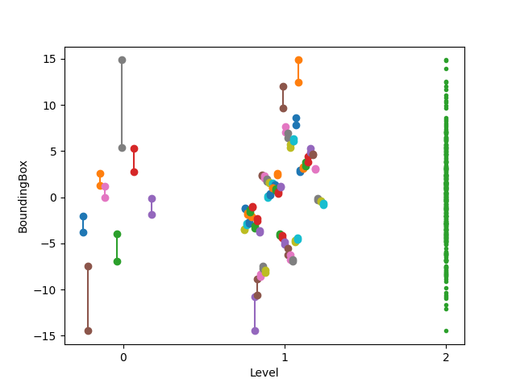
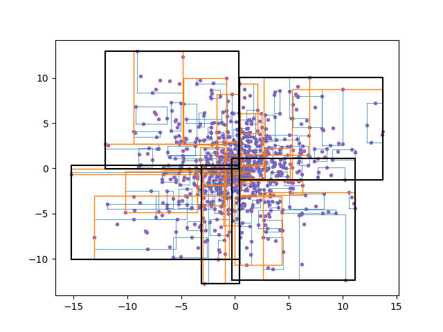
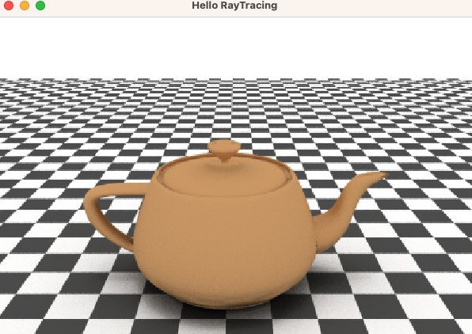

# RTree
Header-Only N-dimensional R-Tree, R*-Tree implementation on Modern C++

And some features to read-only query in GPU ( CUDA, OpenCL, etc. )

## Features
 - Header-Only
 - N-dimensional R-Tree, R*-Tree implementation
 - Customizable types ( bounding box, key, data ) with `geometry_traits`
 - convert to contiguous memory layout Read-only query in GPU ( CUDA, OpenCL, etc. )
 - Quadratic Split, R*-Tree Axis Split (default)
 - Reinsert scheme (default = 0.3*MaxEntry)

## References
 Guttman, A. (1984). "R-Trees: A Dynamic Index Structure for Spatial Searching". Proceedings of the 1984 ACM SIGMOD international conference on Management of data – SIGMOD '84. p. 47.

 Norbert Beckmann, Hans-Peter begel, Ralf Schneider, Bernhard Seeger (1990). "The R*-tree: An Efficient and Robust Access Method for Points and Rectangles". Proceedings of the 1990 ACM SIGMOD international conference on Management of data - SIGMOD '90. p. 322-331.

## Dependencies
 **No dependencies required** for core library.

 Unit Tests are using [Google Test](https://github.com/google/googletest), examples are using [Eigen](https://eigen.tuxfamily.org/).

## Sample Codes

example code in `example/sample/sample.cpp`

```cpp
#include <RTree.hpp>
#include <iostream>
#include <iterator>
#include <type_traits>

// bounding box representation type
using aabb_type = eh::rtree::aabb_t<double>;

// RTree representation type
// using aabb_type as bounding box,
// double as per-data key_type
// int as per-data data_type
using rtree_type = eh::rtree::RTree<aabb_type, double, int>;

// std::map - like member types;
// value_type = std::pair< key_type, mapped_type >
using value_type = rtree_type::value_type;
using iterator = rtree_type::iterator;
using const_iterator = rtree_type::const_iterator;
static_assert(std::is_same<std::iterator_traits<iterator>::iterator_category,
                           std::bidirectional_iterator_tag>::value,
              "Iterators are Bidirectional Iterator");

// query points inside range
void search_range(rtree_type const& rtree, aabb_type const& range);

int main()
{
  // ***************************
  // one-dimension RTree example
  // ***************************

  rtree_type rtree;

  // insert 100 arithmetic sequence of points
  for (int i = 0; i < 50; ++i)
  {
    double point = i;
    int value = i;
    rtree.insert(value_type(point, value));
  }

  // rtree.begin(), rtree.end()
  // iterates over all values in the tree
  for (value_type value : rtree)
  {
    std::cout << "Value Inserted: [" << value.first << ", " << value.second
              << "]\n";
  }

  // access node data directly
  constexpr int ROOT_LEVEL = 0;
  rtree_type::node_type* node = rtree.root();

  // if 'node' is on leaf level, must cast it to leaf_type
  // since leaf_node and node have different member structures, but treated as
  // same 'node-pointer'
  if (rtree.leaf_level() == ROOT_LEVEL)
  {
    rtree_type::leaf_type* leaf
        = reinterpret_cast<rtree_type::leaf_type*>(node);
    // can be simplified to:
    // rtree_type::leaf_type* leaf = node->as_leaf();
  }

  // begin(), end() implemented on node|leaf _type
  // iterates over all child in that node
  for (auto child : *node)
  {
    auto child_bounding_box = child.first; // bounding box
    auto* child_node = child.second->as_node(); // child node pointer
  }

  // leaf's child is value_type
  for (auto& leaf_child : *node->as_leaf())
  {
    auto child_bounding_box = leaf_child.first;
    auto& child_data = leaf_child.second;
  }

  // spatial query in rtree example
  // query points in range [10.5, 20.5]
  search_range(rtree, aabb_type(10.5, 20.5));
  // this print 10 points in range [10.5, 20.5]

  return 0;
}

/*
  Note that 'node' does not have variable of 'level' or 'height'.
  Thoes could be calculated by traversing from node to the root, but it takes
  log(N) time complexity to calculate.
  So it is better to pass 'level' as parameter to recursive function.
  */
void search_node_recursive(rtree_type const& rtree,
                           rtree_type::node_type const* node,
                           aabb_type const& range,
                           int node_level)
{
  if (node_level == rtree.leaf_level())
  {
    // 'node' is on leaf level
    auto* leaf = node->as_leaf();
    for (auto value : *leaf)
    {
      // check if value is in range
      if (rtree_type::traits::is_inside(range, value.first))
      {
        std::cout << "Value Found: [" << value.first << ", " << value.second
                  << "]\n";
      }
    }
  }
  else
  {
    // 'node' is not leaf_node
    for (auto child_node : *node)
    {
      // check if child_node possibly contains value in range
      if (rtree_type::traits::is_overlap(child_node.first, range))
      {
        // search recursively on child node
        search_node_recursive(rtree, child_node.second->as_node(), range,
                              node_level + 1);
      }
    }
  }
}

void search_range(rtree_type const& rtree, aabb_type const& range)
{
  search_node_recursive(rtree, rtree.root(), range, 0);
}
```

## Using your own linear-algebra types

To use custom linear algebra types ( eg. Eigen::Vector3f ), you must implement `eh::rtree::geometry_traits`.

example below ( `example/eigen/main.cpp` ) shows how to link `Eigen::Vector<>` types to `RTree<>`.

```cpp
#include <Eigen/Core>
#include <RTree.hpp>

// use custom vector type in RTree class
// link Eigen3::Vector type to geometry_traits

// define AABB type with Eigen::Vector
template <typename T, unsigned int Size>
struct my_rect_aabb
{
  using vec_t = Eigen::Vector<T, Size>;

  vec_t min_, max_;

  // point to rect implicit conversion
  // only if you use point
  // ( geometry object that does not have volume in N-dimension ) as key_type
  my_rect_aabb(vec_t const& point)
      : min_(point)
      , max_(point)
  {
  }
  my_rect_aabb(vec_t const& min__, vec_t const& max__)
      : min_(min__)
      , max_(max__)
  {
  }
};

namespace eh
{
namespace rtree
{

// implement geometry_traits for my_rect_aabb
template <typename T, unsigned int Size>
struct geometry_traits<my_rect_aabb<T, Size>>
{
  using rect_t = my_rect_aabb<T, Size>;
  using vec_t = typename rect_t::vec_t;

  // ===================== MUST IMPLEMENT =====================
  constexpr static int DIM = Size;

  // must define area_type as arithmetic_type
  // such that, std::numeric_limits<area_type>::max(), lowest() is defined
  using area_type = T;

  // only if you use point
  // ( geometry object that does not have volume in N-dimension ) as key_type
  static bool is_inside(rect_t const& rect, vec_t const& v)
  {
    return (rect.min_.array() <= v.array()).all()
           && (v.array() <= rect.max_.array()).all();
  }
  static bool is_inside(rect_t const& rect, rect_t const& rect2)
  {
    return (rect.min_.array() <= rect2.min_.array()).all()
           && (rect2.max_.array() <= rect.max_.array()).all();
  }

  // only if you use point
  // ( geometry object that does not have volume in N-dimension ) as key_type
  static bool is_overlap(rect_t const& rect, vec_t const& v)
  {
    return is_inside(rect, v);
  }
  static bool is_overlap(rect_t const& rect, rect_t const& rect2)
  {
    if ((rect2.min_.array() > rect.max_.array()).any())
    {
      return false;
    }
    if ((rect.min_.array() > rect2.max_.array()).any())
    {
      return false;
    }
    return true;
  }

  // only if you use point
  // ( geometry object that does not have volume in N-dimension ) as key_type
  static rect_t merge(rect_t const& rect, vec_t const& v)
  {
    return { rect.min_.array().min(v.array()),
             rect.max_.array().max(v.array()) };
  }
  static rect_t merge(rect_t const& rect, rect_t const& rect2)
  {
    return { rect.min_.array().min(rect2.min_.array()),
             rect.max_.array().max(rect2.max_.array()) };
  }

  static area_type area(rect_t const& rect)
  {
    area_type ret = 1;
    for (unsigned int i = 0; i < Size; ++i)
    {
      ret *= (rect.max_[i] - rect.min_[i]);
    }
    return ret;
  }

  // get scalar value of min_point in axis
  static auto min_point(rect_t const& bound, int axis)
  {
    return bound.min_[axis];
  }
  // get scalar value of max_point in axis
  static auto max_point(rect_t const& bound, int axis)
  {
    return bound.max_[axis];
  }
  // sum of all length of bound for all dimension
  static auto margin(rect_t const& bound)
  {
    area_type ret = 0;
    for (unsigned int i = 0; i < Size; ++i)
    {
      ret += bound.max_[i] - bound.min_[i];
    }
    return ret;
  }

  static rect_t intersection(rect_t const& rect1, rect_t const& rect2)
  {
    const vec_t ret_min = rect1.min_.array().max(rect2.min_.array());
    return { ret_min,
             rect1.max_.array().max(rect2.max_.array()).min(ret_min.array()) };
  }

  // distance between center of bounds
  // used in reinserting
  // returned value is used to sort the reinserted nodes,
  // so no need to call sqrt() nor to be super-accurate
  static auto distance_center(rect_t const& rect1, rect_t const& rect2)
  {
    return (rect1.min_ + rect1.max_ - rect2.min_ - rect2.max_).squaredNorm();
  }

  // ===================== MUST IMPLEMENT =====================
};

}
}

int main()
{
  using vec_t = Eigen::Vector<double, 3>;
  using rect_t = my_rect_aabb<double, 3>;
  // pass your AABB type (and vec_t for key_type) to template argument
  using rtree_t = eh::rtree::RTree<rect_t, vec_t, int>;
  //                                ^ AABB   ^ key  ^ data
  //                                         <------------> value_type
  rtree_t rtree;

  rtree.insert({ vec_t { 0, 0, 0 }, 0 });
  rtree.insert({ vec_t { 0.5, 0.5, 0.5 }, 1 });
  rtree.insert({ vec_t { 0.7, 0.7, 0.7 }, 2 });
  rtree.insert({ vec_t { 0.7, 1.3, 0.7 }, 3 });

  rtree.search_inside(
      rect_t { vec_t { 0.1, 0.1, 0.1 }, vec_t { 1.1, 1.1, 1.1 } },
      [](rtree_t::value_type val)
      {
        std::cout << "Value Inside [0.1,0.1,0.1]x[1.1,1.1,1.1]: " << val.second
                  << "\n";
        // continue search
        return false;
      });

  return 0;
}
```

## For usage in GPU ( CUDA, OpenCL, etc. )
`RTree::flatten()` function is provided to convert RTree structure to linear array. From this dense array, you can easily load it to GPU memory.

```cpp
// Example usage of the flatten function
rtree_type rtree = /* construct and populate your RTree */;
rtree_type::flatten_result_t flatten = rtree.flatten();

// Now you can load 'flatten' into GPU memory for processing
```

### flatten_result_t structure

The return type of `RTree::flatten()` is `flatten_result_t`, which contains all the necessary information to query RTree structure.
```cpp
struct flatten_result_t
{
  // leaf node's level
  size_type leaf_level;

  // root node index; must be 0
  size_type root;

  // node information ( include leaf nodes )
  std::vector<flatten_node_t> nodes;

  // global dense buffer of children_boundingbox
  std::vector<geometry_type> children_bound;
  // global dense buffer of children index
  std::vector<size_type> children;

  // inserted data
  std::vector<mapped_type> data;
};
```
 - `leaf_level`: Indicates the level of the leaf nodes in the tree.
 - `root`: The index of the root node in the nodes array. This must always be 0.
 - `nodes`: A vector containing all the nodes of the RTree, including both internal and leaf nodes.
 - `children_bound`: A global dense buffer holding the bounding boxes of all children nodes.
 - `children`: A global dense buffer holding the indices of all children nodes.
 - `data`: A vector containing the actual data stored in the leaf nodes.


### flatten_node_t structure
```cpp
// node information
struct flatten_node_t
{
  // offset in global dense buffer
  size_type offset;

  // the number of children
  size_type size;

  // Can retrieve child node's information by
  // children_bound[ offset + i ] and children[ offset + i ]
  // for i in range(0 ... size)

  // for leaf node ( level == leaf_level ),
  // children[ offset + i ] is the index on array 'data'
  // which is, the real data you inserted

  // for normal node ( level < leaf_level ),
  // children[ offset + i ] is the index on array 'nodes'

  // nodes[0] is the root node

  // parent node index
  size_type parent;
};
```
 - `offset`: Indicates the starting position in the global dense buffers (children_bound and children) for the children of this node.
 - `size`: The number of children this node has.
 - `parent`: The index of the parent node in the nodes array.

 The children of a node can be retrieved using the offset and size values. For leaf nodes (where level == leaf_level), the children array points to indices in the data array. For non-leaf nodes (where level < leaf_level), the children array points to indices in the nodes array.


## Visualization Examples

### R-Tree structure visualization


This image was created with the assistance of ChatGPT, an AI language model developed by OpenAI.

The image is a diagram that visually represents the structure of an RTree, which is used for efficiently managing and searching spatial data. The diagram uses a Black and White theme and displays the following structure:

 - **root node (Level 0):**

    The topmost node, displayed in black.
 - **intermediate nodes (Level 1):**

    Child nodes of the root node, shown in dark gray. These nodes have leaf nodes as their children.
 - **leaf nodes (leaf_level):**

    Nodes containing data nodes, shown in light gray. Each leaf node has actual data items as its children.
 - **data nodes:**

    Children of the leaf nodes representing the actual data. They are shown in light gray in the Black and White theme.
bounding box information:

Each edge connecting the nodes includes bounding box information displayed as text. This represents the spatial relationship between nodes.


### 1-dimensional R-Tree structure visualization
`example/visualize_1d`



The x-axis illustrates different levels within the R-tree, and the y-axis displays the size of bounding boxes (in one dimension) for each node.

On the far right, there are green dots representing input points (N = 300). These points are generated from a normal distribution with a mean ($\mu$) of 0 and a standard deviation ($\sigma$) of 5.


### 2-dimensional R-Tree structure visualization
`example/visualize_2d`



The bounding boxes on the graph indicate the coverage range of each node. Additionally, the thickness and color of these bounding boxes are about their respective levels. 'blue', 'orange', and 'black' are used to represent levels 2, 1, and 0, respectively.

Purple dots represent input points (N = 1000), generated from a normal distribution with an origin of (0,0), a mean ($\mu$) of 0, and a standard deviation ($\sigma$) of 5.

Both the Splitting scheme and reinsertion algorithm applied.


### Spatial Indexing and Raycasting

[This Project](https://github.com/ehwan/RayTracing)


